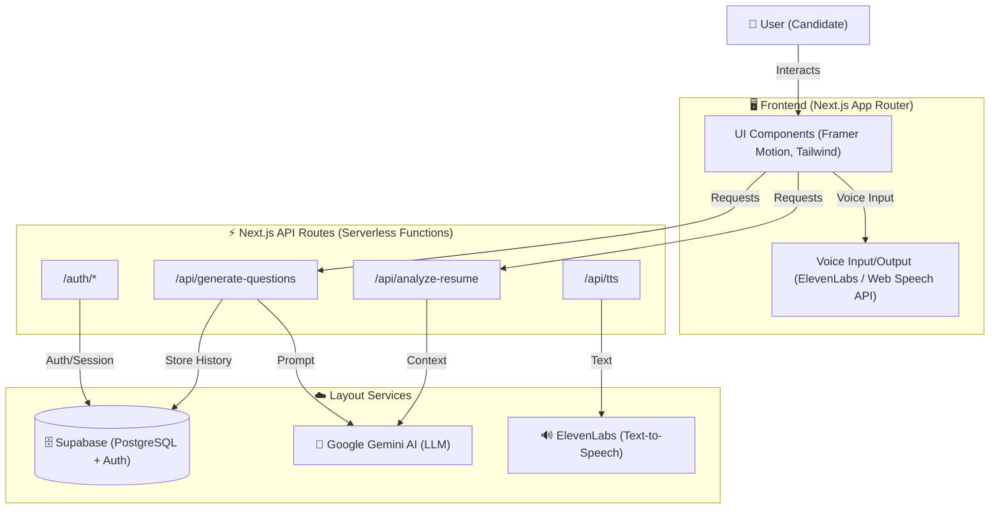

# 🧠 NoQwit.ai (formerly EA.ai)

> An AI-powered mock interview platform that helps users practice real-world interviews through adaptive questioning, voice interaction, and intelligent feedback.

---

## 🏗️ System Design

The application follows a modern **Serverless / Edge-first architecture** primarily powered by Next.js and Supabase.



### Data Flow
1. **User Auth**: All authentication is handled by Supabase Auth (migrated from Appwrite).
2. **Interview Session**:
   - User starts session -> specific resume/JD context is sent to **Gemini**.
   - Gemini generates questions based on context.
   - User speaks -> Browser Speech-to-Text converts to string.
   - Answer is sent to Gemini for feedback + Next Question.
   - AI Response text is sent to **ElevenLabs** (or browser TTS) for audio playback.

---

## ❓ Why's & What's

### **Why Next.js?**
- **Unified Stack**: React for UI and API Routes for backend logic in one repository.
- **Server Components**: We use RSC (React Server Components) for secure data fetching (like user profile) explicitly on the server.
- **Performance**: Static generation for marketing pages, dynamic rendering for the dashboard.

### **Why Supabase?**
- **Relational Data**: Unlike Appwrite (document-based), Supabase gives us a real PostgreSQL database, which is better for structured data like `interview_sessions` and `user_profiles`.
- **Auth**: Built-in rugged authentication with RLS (Row Level Security) ensures users can only access their own data.

### **Why Gemini?**
- **Multimodal**: Good at understanding context from resumes and job descriptions.
- **Cost/Speed**: currently offers a great balance of latency and cost for real-time chat interfaces compared to GPT-4.

---

## 📜 Licensing

This project uses a **dual-licensing strategy** to protect core business logic while keeping UI components open for learning and reuse.

### **Business Source License 1.1 (Restrictive)**

The following components are licensed under **Business Source License 1.1** and are **not permitted for commercial SaaS reuse** without explicit permission:

- **Backend API Routes** (`src/app/api/`)
  - All server-side endpoints (TTS, user profile, login history, etc.)
- **AI & Automation Services** (`src/components/ai-interview-coach/services/`)
  - Gemini AI integration (`geminiService.ts`)
  - Audio processing (`audioService.ts`)
- **Core Business Logic** (`src/components/ai-interview-coach/hooks/useInterview.ts`)
  - Interview orchestration and state management
- **Backend Infrastructure** (`src/lib/`)
  - Supabase client (`supabase.ts`)
  - Appwrite client (`appwrite.ts`)
- **Middleware** (`src/middleware.ts`)

**Restrictions:**
- ✅ **Allowed**: Non-production use, evaluation, learning, portfolio demonstration
- ❌ **Not Allowed**: Production use as a competing SaaS service without a commercial license

**Change Date:** February 4, 2029  
**Change License:** Apache License 2.0 (after change date, restrictions lift)

See `LICENSE-BUSL-1.1.txt` for full terms.

### **MIT License (Open Source)**

The following components are licensed under the **MIT License** and are free for reuse:

- **UI Components** (`src/components/ui/`)
  - All reusable design components (buttons, inputs, cards, etc.)
- **Landing Page Sections** (`src/components/sections/`)
  - Marketing page components
- **AI Interview UI Components** (`src/components/ai-interview-coach/components/`)
  - Presentation layer components (FeedbackScreen, InterviewScreen, SetupScreen, etc.)
- **Utility Functions** (`src/lib/utils.ts`)
  - Generic helper functions (e.g., `cn()` for className merging)
- **UI Hooks** (`src/components/hooks/`)
  - Reusable React hooks (e.g., `use-outside-click.ts`)
- **Type Definitions** (`src/components/ai-interview-coach/types.ts`)
  - TypeScript interfaces and types

See `LICENSE-MIT.txt` for full terms.

### **Identifying Licensed Files**

- Files with **BUSL-1.1** license include a header comment referencing `LICENSE-BUSL-1.1.txt`
- Files with **MIT** license include a header comment referencing `LICENSE-MIT.txt`
- Some UI components may not have headers but are MIT-licensed by default (see directory structure above)

### **Portfolio Project Notice**

This repository is maintained for **demonstration and evaluation purposes**. It showcases technical implementation, architecture decisions, and development practices. **Commercial reuse of the core business logic as a competing SaaS service requires explicit permission from the copyright holder.**

---

## 📂 Folder Structure

The project is contained within the `ea` directory.

```text
/
├── MIGRATION_COMPLETE.md    # Docs on the Appwrite -> Supabase migration
├── ea/                      # MAIN APPLICATION CODE
│   ├── src/
│   │   ├── app/             # Next.js App Router (Pages & API)
│   │   │   ├── api/         # Backend endpoints (Gemini, TTS, etc.)
│   │   │   ├── components/  # Page-specific components
│   │   │   ├── dashboard/   # User Dashboard pages
│   │   │   └── interview/   # Active interview session pages
│   │   ├── components/      # Shared UI components (Buttons, Inputs)
│   │   ├── lib/             # Utilities (Supabase client, Helpers)
│   │   └── backend/         # [LEGACY] Potential old python backend
│   ├── controllers/         # [LEGACY] Unused Express controllers
│   ├── routes/              # [LEGACY] Unused Express routes
│   └── public/              # Static assets
└── package.json             # Root workspace config
```

---

## 🛠️ Maintenance & Known Issues (For Devs)

This project has evolved and contains some legacy artifacts that new developers can help clean up.

### 1. Legacy Express Backend
- **Location**: `ea/controllers/` and `ea/routes/`
- **Issue**: These files (`userController.js`, `userRoutes.js`) use Express logic (`module.exports`, `res.status`). However, there is no `server.js` actively running them. The app now uses Next.js API routes (`ea/src/app/api`).
- **Fix**: Verify no logic is missing from the Next.js API routes, then **delete** these folders.

### 2. Python Artifacts
- **Location**: `ea/backend/` and `ea/__pycache__/`
- **Issue**: Presence of `__pycache__` suggests a Python backend was once used or tested.
- **Fix**: If the Python backend is no longer part of the stack (which seems true as `package.json` scripts don't reference it), these should be removed to avoid confusion.

### 3. Root vs. `ea` Package.json
- **Issue**: There is a `package.json` in the root AND in `ea/`.
- **Fix**: The root `package.json` script `"start": "node ea/server.js"` will likely fail because `ea/server.js` does not exist. Development should focus on `ea/package.json`.
- **Recommendation**: Update root scripts to proxy into `ea` correctly (e.g., `"dev": "cd ea && npm run dev"`).

---

## 🚀 Getting Started

1. **Navigate to the core app**:
   ```bash
   cd ea
   ```

2. **Install Dependencies**:
   ```bash
   npm install
   ```

3. **Environment Setup**:
   Create `.env.local` in `ea/` directory with:
   ```env
   NEXT_PUBLIC_SUPABASE_URL=...
   NEXT_PUBLIC_SUPABASE_ANON_KEY=...
   GEMINI_API_KEY=...
   ELEVENLABS_API_KEY=...
   ```

4. **Run Dev Server**:
   ```bash
   npm run dev
   ```
